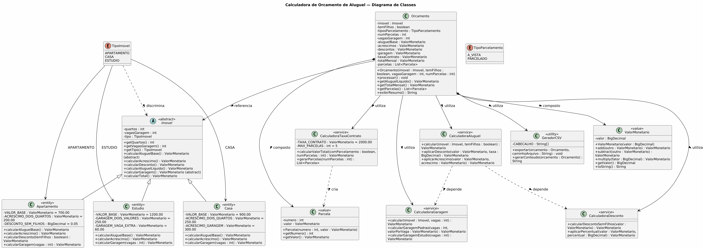

# Modelagem do Problema — Calculadora de Orçamento de Aluguel

## 1. Identificação do Problema

- **Nome do Problema:** Calculadora de Orçamento de Aluguel
- **Descrição:** Desenvolver uma aplicação para automatizar a geração de orçamentos de imóveis para a empresa R.M, considerando três tipos de propriedades (apartamentos, casas e estúdios) com regras específicas de cálculo de valor, acréscimos, descontos e parcelamento.
- **Origem/Referência:** Projeto acadêmico — Algoritmos e POO
- **Nível de Dificuldade:** Médio

## 2. Análise do Problema

### 2.1 Business Drivers (Motivadores de Negócio)

- **Automação de Processos:** Automatizar a geração de orçamentos de imóveis, reduzindo o esforço manual
- **Eficiência Operacional:** Facilitar as necessidades operacionais e comerciais da imobiliária, que lida com diversos tipos de propriedades
- **Melhoria no Atendimento ao Cliente:** Prover uma ferramenta rápida e precisa para que os clientes recebam orçamentos detalhados de locação

### 2.2 Entrada

| Campo | Tipo | Descrição |
|-------|------|-----------|
| Tipo de imóvel | Enum/String | Apartamento, Casa ou Estúdio |
| Número de quartos | Int | Quantidade de quartos do imóvel |
| Possui filhos? | Boolean | Indica se o locatário tem filhos (aplica desconto para apartamentos) |
| Vagas de garagem | Int | Número de vagas de garagem desejadas |
| Parcelar contrato? | Boolean | Indica se a taxa de contrato será parcelada |
| Número de parcelas | Int | Quantidade de parcelas (máximo 5) |

### 2.3 Saída

- Valor total do aluguel mensal (base + acréscimos - descontos)
- Parcela da taxa de contrato (se parcelada)
- Valor total mensal (aluguel + parcela do contrato)
- Arquivo `.csv` com as 12 parcelas do orçamento planejado

### 2.4 Regras de Cálculo

| Regra | Condição | Valor |
|-------|----------|-------|
| Aluguel base — Apartamento | Qualquer | R$ 700,00 |
| Aluguel base — Casa | Qualquer | R$ 900,00 |
| Aluguel base — Estúdio | Qualquer | R$ 1.200,00 |
| Acrescimo — Apartamento 2 quartos | quartos == 2 | +R$ 200,00 |
| Acrescimo — Casa 2 quartos | quartos == 2 | +R$ 250,00 |
| Garagem — Casa | vagas > 0 | +R$ 300,00 por vaga |
| Garagem — Apartamento | vagas > 0 | +R$ 300,00 por vaga |
| Garagem — Estúdio | vagas == 2 | +R$ 250,00 total |
| Garagem — Estúdio | vagas > 2 | +R$ 250,00 + R$ 60,00 por vaga extra |
| Desconto — Apartamento sem filhos | tipo == Apartamento AND filhos == false | -5% no aluguel |
| Taxa de Contrato | Fixo | R$ 2.000,00 |
| Parcelamento contrato | parcelar == true | Até 5 parcelas |

### 2.5 Exemplos

| # | Tipo | Quartos | Filhos | Vagas | Parcelar | Saída Esperada |
|---|------|---------|--------|-------|----------|----------------|
| 1 | Apartamento | 2 | Não | 1 | Sim | Aluguel: R$ 840,00 (700+200-5%) + Parcela contrato: R$ 400,00 = Total: R$ 1.240,00 |
| 2 | Casa | 2 | Sim | 2 | Não | Aluguel: R$ 1.150,00 (900+250) + Parcela: R$ 0,00 = Total: R$ 1.150,00 |
| 3 | Estúdio | 0 | Não | 3 | Sim | Aluguel: R$ 1.200,00 + Garagem: R$ 310,00 (250+60) = R$ 1.510,00 + Parcela: R$ 400,00 = Total: R$ 1.910,00 |

## 3. Restrições

- **Valores monetários:** Todos os cálculos devem usar precisão decimal ( evitar float para moeda)
- **Limite de parcelas:** Máximo de 5 parcelas para taxa de contrato
- **Formato de exportação:** Obrigatório arquivo `.csv` com 12 parcelas
- **Validação de entrada:** Tipo de imóvel deve ser obrigatoriamente um dos três válidos
- **Programação Orientada a Objetos:** O sistema deve utilizar POO obrigatoriamente

## 4. Abordagem de Solução

### 4.1 Estratégia Geral

Aplicar os princípios de Programação Orientada a Objetos com uma arquitetura modular em camadas, separando as regras de negócio, a apresentação e a persistência de dados. O sistema utiliza modelagem estática orientada a classes com abstração, herança e composição.

### 4.2 Diagrama de Classes



### 4.3 Estrutura de Classes

| Classe | Tipo | Responsabilidade |
|--------|------|-----------------|
| `Imovel` (abstract) | Abstract | Entidade base: quartos, vagas, cálculos de aluguel e garagem |
| `Apartamento` | Entity | Aluguel base R$ 700, acréscimo R$ 200 (2 quartos), desconto 5% sem filhos |
| `Casa` | Entity | Aluguel base R$ 900, acréscimo R$ 250 (2 quartos), R$ 300 por vaga |
| `Estudio` | Entity | Aluguel base R$ 1.200, regras de garagem específicas (R$ 250 por 2 vagas + R$ 60 por extra) |
| `ValorMonetario` | Value Object | Wrapper `BigDecimal` para precisão em cálculos monetários |
| `Parcela` | Value Object | Representa uma parcela com número e valor |
| `TipoImovel` | Enum | APARTAMENTO, CASA, ESTUDIO |
| `TipoParcelamento` | Enum | A_VISTA, PARCELADO |
| `CalculadoraAluguel` | Service | Orquestra cálculos de aluguel e descontos |
| `CalculadoraGaragem` | Service | Calcula custos de garagem por tipo de imóvel |
| `CalculadoraDesconto` | Service | Aplica regras de desconto |
| `CalculadoraTaxaContrato` | Service | Calcula taxa de contrato (R$ 2.000) e parcelamento (até 5x) |
| `Orcamento` | Entity | Agrega todas as informações e gera o resultado final |
| `GeradorCSV` | Utility | Exporta o orçamento para arquivo `.csv` com 12 parcelas |

## 5. Modelagem Dinâmica (Diagrama de Sequência)

### 5.1 Arquitetura de Camadas — Interação

O diagrama de sequência a seguir representa o fluxo dinâmico da aplicação, mostrando como cada camada interage durante o processamento de um orçamento:


### 5.2 Fluxo de Interação

| Passo | Origem | Destino | Ação |
|-------|--------|---------|------|
| 1 | Usuário | View | Envia dados do imóvel (tipo, quartos, filhos, vagas, parcelar) |
| 2 | View | Controle | `processarOrcamento(dados)` |
| 3 | Controle | Model | `criarImovel(tipo, quartos, vagas)` |
| 4 | Model | Controle | Retorna objeto `Imovel` |
| 5 | Controle | Model | `calcularAluguelBase(imovel)` |
| 6 | Controle | Model | `calcularAcrescimos(imovel)` |
| 7 | Controle | Model | `calcularDesconto(imovel, temFilhos)` — apenas se apartamento sem filhos |
| 8 | Controle | Model | `calcularGaragem(imovel, vagas)` |
| 9 | Controle | Model | `calcularTotalMensal(...)` |
| 10 | Controle | Model | `calcularTaxaContrato(numParcelas)` |
| 11 | Controle | Persistência | `exportarCSV(orcamento, "orcamento.csv")` |
| 12 | Persistência | Controle | Retorna arquivo CSV gerado |
| 13 | Controle | View | Retorna `Orcamento` completo |
| 14 | View | Usuário | Exibe resumo e link do CSV |

### 5.3 Camadas Envolvidas

| Camada | Participante | Responsabilidade |
|--------|-------------|-----------------|
| **View** | CLI / HTML | Interface com o usuário, entrada de dados e exibição de resultados |
| **Controle** | `Orcamento` | Orquestra o fluxo, invoca os services e coordena a saída |
| **Model** | `Imovel`, `Calculadoras` | Regras de negócio, cálculos e entidades de domínio |
| **Persistência** | `GeradorCSV` | Gera o arquivo `.csv` com as 12 parcelas |

## 6. Arquitetura do Software

### 6.1 Arquitetura Modular por Camadas


### 6.2 Fluxograma

O fluxograma do fluxo principal está disponível no arquivo `plantuml/fluxograma.puml` e pode ser renderizado com:

```bash
plantuml plantuml/fluxograma.puml -o plantuml/
```

## 7. Tecnologias Propostas

| Componente | Tecnologia | Justificativa |
|------------|-----------|---------------|
| Linguagem | Python | Vasta documentação e tutoriais disponíveis |
| Interface | HTML + CSS (opcional) | Interface web amigável |
| Framework Web (opcional) | Flask ou Django | Integração Python + HTML/CSS |
| Geração CSV | Biblioteca nativa `csv` do Python | Padrão interoperável |
| Controle de Versão | GitHub | Obrigatório para o projeto |
| Design de Diagramas | PlantUML + Graphviz | Diagramas de classes e fluxograma em formato PNG |

## 8. Implementação — Esqueleto em Python

```python
class Imovel:
    def __init__(self, quartos, vagas):
        self.quartos = quartos
        self.vagas = vagas

    def calcular_aluguel_base(self):
        raise NotImplementedError


class Apartamento(Imovel):
    VALOR_BASE = 700.0
    ACRESCIMO_DOIS_QUARTOS = 200.0
    DESCONTO_SEM_FILHOS = 0.05

    def calcular_aluguel_base(self):
        valor = self.VALOR_BASE
        if self.quartos == 2:
            valor += self.ACRESCIMO_DOIS_QUARTOS
        return valor


class Casa(Imovel):
    VALOR_BASE = 900.0
    ACRESCIMO_DOIS_QUARTOS = 250.0

    def calcular_aluguel_base(self):
        valor = self.VALOR_BASE
        if self.quartos == 2:
            valor += self.ACRESCIMO_DOIS_QUARTOS
        return valor


class Estudio(Imovel):
    VALOR_BASE = 1200.0
    GARAGEM_DUAS_VAGAS = 250.0
    GARAGEM_EXTRA = 60.0

    def calcular_aluguel_base(self):
        return self.VALOR_BASE

    def calcular_garagem(self):
        if self.vagas <= 2:
            return self.GARAGEM_DUAS_VAGAS
        return self.GARAGEM_DUAS_VAGAS + (self.vagas - 2) * self.GARAGEM_EXTRA
```

## 9. Casos Especiais

- Apartamento sem filhos com 2 quartos e 1 vaga → desconto de 5% se aplicável
- Estúdio com 0 vagas → sem custo de garagem
- Estúdio com 1 vaga → regra proporcional (verificar se cobrado 1 vaga extra ou se mínimo é 2 vagas)
- Casa com mais de 2 quartos → sem acréscimo adicional (não há regra definida para 3+ quartos)
- Tipo de imóvel inválido → tratamento de erro / entrada inválida

## 10. Verificação

- [ ] Exemplo 1 (Apartamento 2 quartos, sem filhos, 1 vaga, parcelado)
- [ ] Exemplo 2 (Casa 2 quartos, com filhos, 2 vagas, não parcelado)
- [ ] Exemplo 3 (Estúdio, sem filhos, 3 vagas, parcelado)
- [ ] Casos limítrofes (estúdio 0 vagas, 1 vaga, 2 vagas, muitas vagas)
- [ ] Exportação CSV contém 12 linhas de parcelas
- [ ] Tratamento de entradas inválidas

## 11. Reflexão Pós-Resolução

- **O que aprendi:**
- **O que poderia ser melhorado:**
- **Complexidade real:**

## 12. Entregáveis do Projeto

- [ ] Código-fonte Python com POO
- [ ] Diagrama de classes (`plantuml/diagrama_classes.puml` → `plantuml/diagrama_classes.png`)
- [ ] Fluxograma (`plantuml/fluxograma.puml` → `plantuml/fluxograma.png`)
- [ ] Documentação da estrutura lógica
- [ ] Arquivo `.csv` de exemplo gerado
- [ ] Repositório no GitHub
- [ ] Este documento de modelagem (`modelagem-problema.md`)